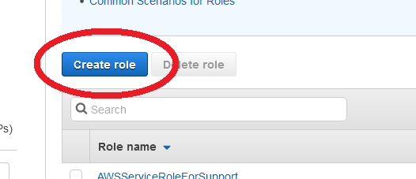
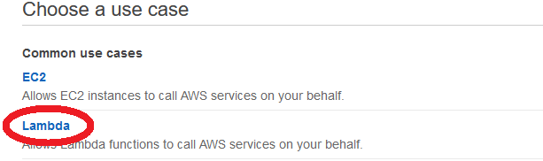
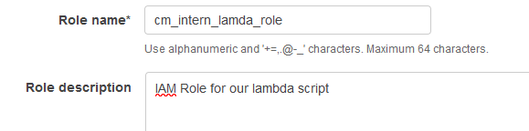
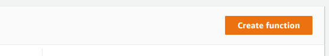
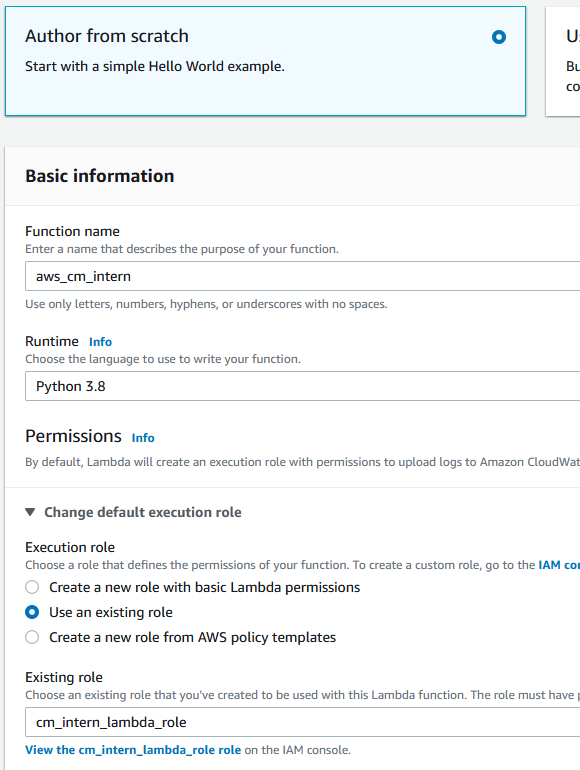
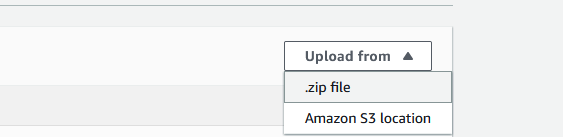
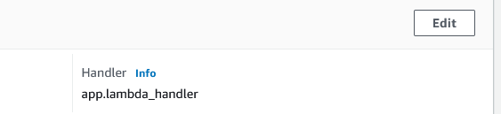
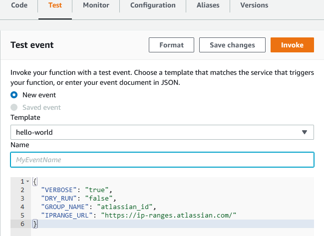
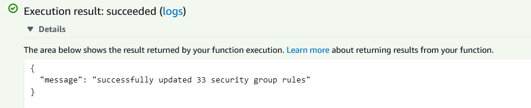
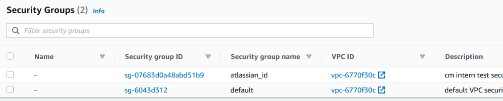

# Alex' CM Intern Assignment #

This project is part of the devops intern interview assignment. It consists of a script meant to be deployed as an aws lambda function, and this documentation.

The goal of the assignment is to:
 * Create a script that will:
    * Get data on ip ranges from a url
    * Parse the data
    * Use the parsed data to update an AWS security group
    
 * Deploy the script on aws lambda to ensure functionality
 * Provide documentation for the script, setting up AWS, and the process of using the script (this)

#### Important files: ####
 * `app/app.py` the script
 * `aws-sam/build/function/` the script and necessary files for deployment as a lambda function
 * `readme.md` this documentation

### Setting up AWS: ###
1. Make an AWS account, or login to the appropriate account if it already exists.
2. Although the script can be run as the root user, it would be best to [create an IAM user with administrative privileges](https://docs.aws.amazon.com/IAM/latest/UserGuide/getting-started_create-admin-group.html "AWS Documentation on creating your first user") if an appropriate account does not yet exist.
3. This script modifies security groups which requires administrative permissions. So we must create an IAM role with higher priviledges than the default 'lambda_basic_execution'
   1. Open AWS console, navigate to IAM Service, and enter the [Roles menu](https://console.aws.amazon.com/iam/home?region=us-east-2#/roles "Link to the IAM Roles menu")
   2. Create new role
   
      
   3. Select Lambda Function
   
      
   4. Add the policy 'AdministratorAccess'
   
      
   5. Name the new role, and review the details. I have named the role 'cm_intern_lambda_role'
   
      

4. Now we will set up our lambda function on AWS. This documentation will show how to do it through the AWS web console, however during development this was done using the [AWS Toolkit for JetBrains](https://docs.aws.amazon.com/toolkit-for-jetbrains/latest/userguide/welcome.html "Documentation for AWS Toolkit for JetBrains"). One more note is that this documentation was made using the updated AWS Lambda console.
   1. Open the [AWS Lambda Service](https://us-east-2.console.aws.amazon.com/lambda/ "Link to AWS Lambda") an select Create Function
    
      
   2. Using 'Author from scratch', name the function, select Python 3.8 as the runtime, and select the execution role that was created earlier.
   
      
   3. Upload the built version of the script from `aws-sam/build/function/`, the archive `aws_cm_intern_function.zip` has been provided for convenience.
   
      
   4. Make sure the function handler has been set correctly for the lambda function. In this case it should be set to `app.lambda_handler`
   
      
   
### Running the Script ###
The script should now be set up and ready to run as a Lambda function. There are many ways to do this, and during development it was done using the [AWS SAM CLI](https://docs.aws.amazon.com/serverless-application-model/latest/developerguide/what-is-sam.html "Link to AWS SAM documentation") through the AWS Toolkit. The easiest way after setting up AWS for the first time would be to run the script through the AWS web console, documentation for which follows.

   Open the [AWS Lambda Service](https://us-east-2.console.aws.amazon.com/lambda/ "Link to AWS Lambda") to the Lambda function that was created earlier, and open the 'Test' menu.

Arguments to the script can be provided in the event.

Key | Description
----|------------
VERBOSE|Provides additional log data when set to "true"
DRY_RUN|Used to set the DryRun argument when accessing aws resources
GROUP_NAME|Used to specify the name of the security group being updated
IPRANGE_URL|Can be used to specify a url to get the iprange data from

If not provided by the event, default values will be used, additional documentation for this can be found in `app.py`

After invoking the script, we can verify that the security group was updated by checking the logs:

We can also verify success of the script by checking the [Security Groups menu in the EC2 Service](https://us-east-2.console.aws.amazon.com/ec2/v2/home?region=us-east-2#SecurityGroups: "Link to security groups page"), it should contain the updated security group. The security group will have been automatically created if it did not exist before running the script.

Another way to run the script would be through the [AWS CLI](https://aws.amazon.com/cli/ "Link to AWS CLI"), by directly invoking the lambda function. After [configuring our credentials](https://docs.aws.amazon.com/cli/latest/userguide/cli-configure-files.html "How to configure credentials for AWS CLI"), the script could be run with the command: `aws lambda invoke --function-name aws_cm_intern out --log-type Tail`

## Conclusion ##

The script provided fulfils all the goals set out by the assignment. There are however further improvements that could be made, particularly in the AWS setup and process of running the script.

If the functionality of the script was required more often than just the one off update of the security group, a better solution than manually invoking the lambda function may be to deploy a full application, using the API Gateway to run the script when necessary.