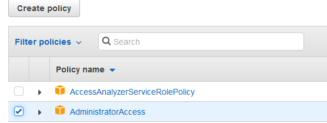

#aws cm intern assignment

This project is part of the devops intern interview assignment. It consists of a script meant to be deployed as an aws lambda function, and this documentation.

The goal of the assignment is to:
 * Create a script that will:
    * Get data on ip ranges from a url
    * Parse the data
    * Use the parsed data to update an AWS security group
    
 * Deploy the script on aws lambda to ensure functionality
 * Provide documentation for the script, setting up AWS, and the process of using the script (this)

####Important files:
 * `app/app.py` the script
 * `aws-sam/build/function/` the script and necessary files for deployment as a lambda function
 * `readme.md` this documentation

##Setting up AWS:
1. Make an AWS account, or login to the appropriate account if it already exists.
2. Although the script can be run as the root user, it would be best to [create an IAM user with administrative privileges](https://docs.aws.amazon.com/IAM/latest/UserGuide/getting-started_create-admin-group.html "AWS Documentation on creating your first user") if an appropriate account does not yet exist.
3. This script modifies security groups which requires administrative permissions. So we must create an IAM role with higher priviledges than the default 'lambda_basic_execution'
   1. Open AWS console, navigate to IAM Service, and enter the [Roles menu](https://console.aws.amazon.com/iam/home?region=us-east-2#/roles "Link to the IAM Roles menu")
   2. Create new role
   
      
   3. Select Lambda Function
   
      
   4. Add the policy 'AdministratorAccess'
   
      
   5. Name the new role, and review the details. I have named the role 'cm_intern_lambda_role'
   
      

4. Now we will set up our lambda function on AWS. This documentation will show how to do it through the AWS web console, however during development this was done using the [AWS Toolkit for JetBrains](https://docs.aws.amazon.com/toolkit-for-jetbrains/latest/userguide/welcome.html "Documentation for AWS Toolkit for JetBrains"). One more note is that this documentation was made using the updated AWS Lambda console.
   1. Open the [AWS Lambda Service](https://us-east-2.console.aws.amazon.com/lambda/ "Link to AWS Lambda") an select Create Function
    
      
   2. Using 'Author from scratch', name the function, select Python 3.8 as the runtime, and select the execution role that was created earlier.
   
      
   3. Upload the built version of the script from `aws-sam/build/function/`, the archive `aws_cm_intern_function.zip` has been provided for convenience.
   
      
   4. Make sure the function handler has been set correctly for the lambda function. In this case it should be set to `app.lambda_handler`
   
      
   
##Running the Script